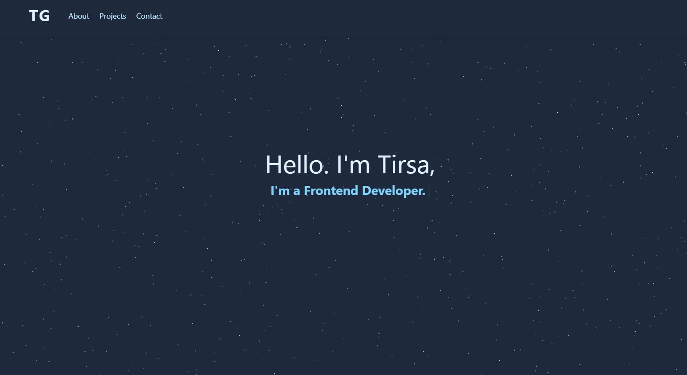
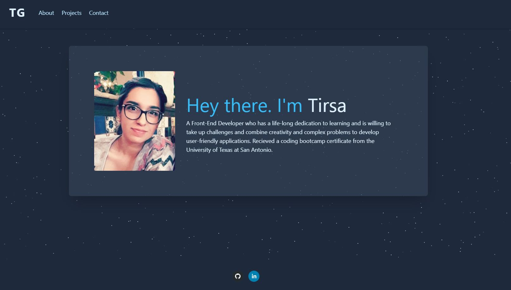
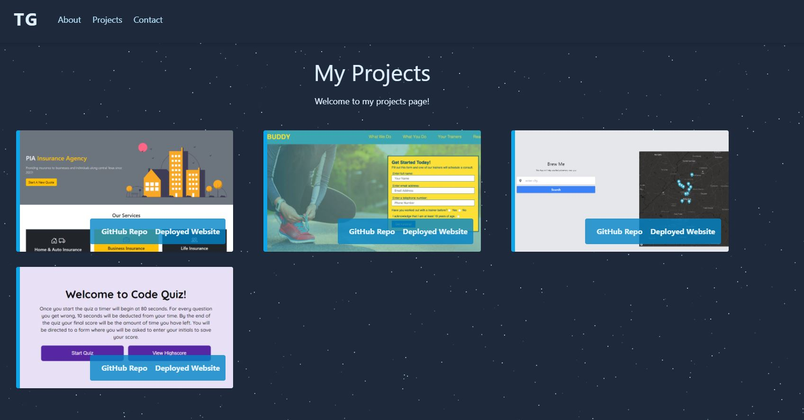
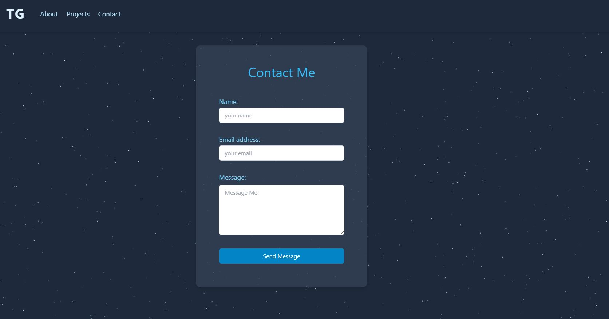

# React Portfolio
## Description
In this project I created a beautifully responsive portfolio using React.js, React Router, JavaScript and Tailwind CSS for styling. The porfolio website was deployed using github pages.

## Tools used
1. Node.js
2. React.js
3. Javacript
4. CSS
5. Tailwind CSS

## Demo

[Website Link](https://trrgomez.github.io/react-deploy/)